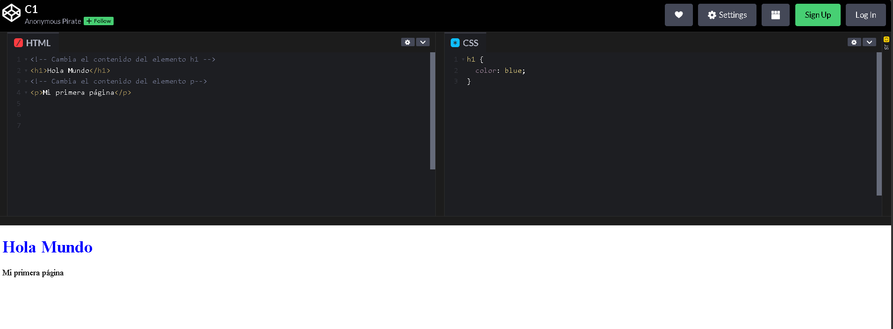

# ¿Qué es el desarrollo web?

## Video de la Clase y Entorno de Práctica

*Enlace al video de YouTube:* [**falta**](falta)

Para esta primera clase y en todo este módulo no necesitas instalar ningún programa en tu computadora. Vamos a usar **CodePen**, un entorno de desarrollo en línea que funciona directamente desde tu navegador web. Solo haz clic en el siguiente enlace y verás el código inicial de la clase: [**https://codepen.io/ST-A-the-encoder/pen/KwNOLdw**](https://codepen.io/ST-A-the-encoder/pen/KwNOLdw)

Una vez que abras el enlace, verás una interfaz dividida en paneles: en la parte superior se encuentran los editores independientes para HTML y CSS (donde escribiremos nuestras instrucciones), y en la parte inferior o lateral se ubica el panel de Resultado, que actúa como la pantalla en tiempo real de tu navegador mostrando cómo cobra vida tu código.

{width=80%}

## Notas de la Clase


**¿Dónde vemos desarrollo web todos los días?** 

Antes de escribir código, pensemos en algo muy simple: casi todo lo que usamos en internet vive dentro de una página o aplicación web. Cuando revisas una tarea, ves un video, lees una noticia o compras algo en línea, estás usando tecnologías web. Por eso aprender HTML y CSS es como aprender el alfabeto básico de internet. No necesitas saberlo todo desde el primer día; solo necesitas entender cómo se construye una página paso a paso.

**La Analogía del Edificio** 

Imagina que una página web es como una casa. El **HTML** son los ladrillos, las paredes y el techo. Es el esqueleto que le da estructura a nuestra información. Por otro lado, el **CSS** es la pintura, los muebles y la decoración. Es lo que hace que nuestra casa (o página web) se vea increíble.

**Separando contenido y apariencia**

Lo importante es separar dos ideas. Primero está el contenido: qué texto aparece, qué título se muestra o qué información queremos comunicar. Esa parte corresponde a HTML. Luego está la presentación: el color del título, el tamaño del texto, los espacios o si algo aparece centrado. Esa parte corresponde a CSS. Separar contenido y estilo hace que una página sea más fácil de entender, corregir y mejorar. Si queremos cambiar el mensaje, tocamos HTML. Si queremos cambiar cómo se ve, tocamos CSS.

**Nuestra Primera Página**

Nuestro primer código HTML será el siguiente, solo observa y visualiza el resultado en CodePen, aún no es necesario memorizar nada.

```html
<h1>Hola Mundo</h1>
<p>Mi primera página</p>
```

Ahora en el panel de CSS, copia lo siguiente. Para esta regla usamos llaves del sector `h1`. Con esto, le comunicamos al navegador que el color del título deberá ser azul.

```css
h1 { 
    color: blue;
}
```

## Actividad Práctica de la Clase: 

**El Reto del Contenido:**

Ahora es tu turno. Cambia el texto "Hola Mundo" por un título propio, como "Bienvenido a mi sitio" o "Mi página personal". Después cambia el párrafo "Mi primera página" por una frase corta, por ejemplo: "Estoy aprendiendo HTML y CSS" o "Aquí compartiré mis intereses". No borres las etiquetas `<h1>`, `</h1>`, `<p>` ni `</p>`. Cambia solo el texto que está en medio.

## Recomendaciones y Errores Comunes para Principiantes

"Un error común al empezar es borrar una parte del código sin darse cuenta. Por ejemplo, si eliminas el cierre `</h1>` o `</p>`, el navegador puede intentar adivinar qué querías hacer, pero el código queda incompleto. En CSS también hay detalles importantes: las reglas usan llaves '{ }', y las instrucciones suelen terminar con punto y coma ';'. Cuando algo no funcione, revisa con calma: ¿cada etiqueta se abrió y se cerró?, ¿la regla de CSS tiene llaves?, ¿la línea termina con punto y coma? Programar también consiste en revisar pequeños detalles.

## Recursos Complementarios de la Clase

- **Código HTML inicial de la lección:** [starter-files/lesson-01/index.html](https://github.com/upc-pre-1asi0730-2610-10215-arcadiadevs/webdev-course-arcadiadevs/blob/main/starter-files/lesson-01/index.html)
- **Código CSS inicial de la lección:** [starter-files/lesson-01/styles.css](https://github.com/upc-pre-1asi0730-2610-10215-arcadiadevs/webdev-course-arcadiadevs/blob/main/starter-files/lesson-01/styles.css)
- **Código HTML final de la lección:** [completed-examples/lesson-01/index.html](https://github.com/upc-pre-1asi0730-2610-10215-arcadiadevs/webdev-course-arcadiadevs/blob/main/completed-examples/lesson-01/index.html)
- **Código CSS final de la lección:** [completed-examples/lesson-01/styles.css](https://github.com/upc-pre-1asi0730-2610-10215-arcadiadevs/webdev-course-arcadiadevs/blob/main/completed-examples/lesson-01/styles.css)