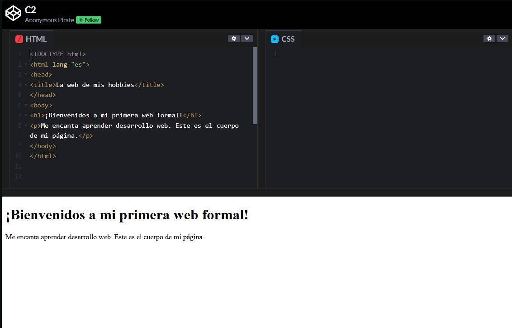

# El esqueleto de tu página

## Video de la Clase y Entorno de Práctica

*Enlace al video de YouTube:* [**https://youtu.be/dfwfEkFlHBM**](https://youtu.be/dfwfEkFlHBM)

Para esta clase continuaremos usando **CodePen**, el mismo entorno en línea que usamos la clase pasada. No necesitas instalar nada en tu computadora. Haz clic en el siguiente enlace para abrir el código inicial de la clase ya precargado: [**https://codepen.io/ST-A-the-encoder/pen/jEVopBv**](https://codepen.io/ST-A-the-encoder/pen/jEVopBv)

Al igual que en la clase anterior, verás la interfaz con los panales divididos.

{width=80%}

## Notas de la Clase

¡Hola de nuevo! En la lección anterior vimos cómo mostrar contenido y darle estilo. Ahora vamos a construir la base de la página para que el navegador entienda dónde empieza todo, dónde va la información de apoyo y qué parte verá el usuario.

**La estructura**

En la lección anterior escribimos contenido simple y vimos que el navegador lo mostraba de inmediato. Eso fue como colocar una pieza suelta en la página. Ahora vamos a ordenar esa pieza dentro de una estructura completa. Así como una persona tiene cabeza y cuerpo, una página HTML también tiene partes principales. Esta estructura ayuda al navegador a entender qué información sirve para configurar la página y qué contenido debe mostrar al visitante.

**La Etiqueta Principal**

Todo empieza con la etiqueta `<html>`. Esta etiqueta envuelve a toda la página. Dentro de la etiqueta de apertura podemos añadir un atributo, como `lang="es"`, para decirle al navegador que el contenido está en español. Esto puede ayudar a traductores automáticos, lectores de pantalla y herramientas de accesibilidad. Aunque el visitante no vea este atributo directamente, usarlo hace que nuestra página esté mejor preparada y sea más clara para distintas herramientas.

**El documento HTML completo y `<!DOCTYPE html>`**

Ahora que ya vimos la etiqueta `<html>`, hay una línea importante que suele aparecer antes de todo: `<!DOCTYPE html>`. Esta línea le indica al navegador que estamos usando HTML moderno. No es una etiqueta como `<html>` o `<body>`, porque no tiene cierre; más bien funciona como una declaración inicial del documento. En una página HTML completa, normalmente escribimos primero `<!DOCTYPE html>`, luego `<html lang="es">`, después `<head>` y finalmente `<body>`. Sin embargo, en CodePen no siempre necesitamos escribir toda la estructura completa. CodePen ya prepara parte del documento por nosotros, por eso muchas veces escribimos directamente las etiquetas que irían dentro del HTML. Aun así, es importante conocer la estructura completa, porque cuando trabajes en un archivo real llamado index.html, sí deberías incluir:

```html
<!DOCTYPE html>
<html>
  <head>
  </head>
  <body>
  </body>
</html>
```

Fíjate cómo las etiquetas se abren y se cierran con una barra inclinada `/`. Es como abrir una caja, poner contenido dentro y luego cerrarla. La indentación nos ayuda a ver qué va dentro de qué, aunque lo más importante es que las etiquetas estén bien anidadas.

Cuando una etiqueta está dentro de otra, decimos que está anidada. Imagina una mochila: dentro de la mochila puedes tener una cartuchera, y dentro de la cartuchera puedes tener lápices. En HTML ocurre algo parecido. La etiqueta `<html>` contiene toda la página.

**La Cabeza (El cerebro de la página)**

Dentro de `<html>`, tenemos la etiqueta `<head>`. Aquí colocamos información importante para el navegador que normalmente no se ve en la página, como el texto que aparece en la pestaña. Ese texto lo escribimos con la etiqueta `<title>`.

**El Cuerpo (Lo que todos ven)**

Luego viene `<body>`, el cuerpo. Aquí colocamos todo lo que queremos que el visitante vea: títulos, párrafos, imágenes y más. Escribamos un título y un pequeño párrafo dentro de esta sección.
 
## Actividad Práctica de la Clase: 

**El Reto de la Indentación:**

Ahora es tu turno. Observa este código: todas las etiquetas están escritas, pero la estructura se ve desordenada porque no tiene indentación. Tu misión es acomodarlo visualmente usando espacios al inicio de cada línea. Recuerda: `<head>` y `<body>` están dentro de <html>, por eso deben ir un poco más a la derecha. Luego, `<title>` está dentro de `<head>`, y `<h1>` y `<p>` están dentro de `<body>`, así que también deben estar indentados.

## Recomendaciones y Errores Comunes para Principiantes

Uno de los errores más normales al empezar es olvidar cerrar una etiqueta. HTML puede ser flexible y a veces el navegador intenta adivinar lo que quisiste escribir, pero no conviene depender de eso. La buena práctica es cerrar cada sección. Si abriste `<head>`, cierras `</head>`. Si abriste `<body>`, cierras `</body>`. Y al final cierras `</html>`. Una forma sencilla de revisar tu código es leerlo como si fueran cajas: abro la caja principal, abro la cabeza, cierro la cabeza, abro el cuerpo, escribo el contenido, cierro el cuerpo y cierro la página. Cuando estés empezando, puedes seguir siempre el mismo orden para no perderte. Primero escribe `<html lang="es">` y su cierre `</html>`. Luego, dentro, agrega `<head>` y coloca el `<title>`. Después escribe `<body>` y dentro agrega lo que el usuario verá: un `<h1>`, un `<p>` o más elementos. Este orden te ayuda a construir la página poco a poco y evita que mezcles información del navegador con contenido visible.

## Recursos Complementarios de la Clase

- **Código HTML inicial de la lección:** [starter-files/lesson-02/index.html](https://github.com/upc-pre-1asi0730-2610-10215-arcadiadevs/webdev-course-arcadiadevs/blob/main/starter-files/lesson-02/index.html)
- **Código HTML final de la lección:** [completed-examples/lesson-02/index.html](https://github.com/upc-pre-1asi0730-2610-10215-arcadiadevs/webdev-course-arcadiadevs/blob/main/completed-examples/lesson-02/index.html)

\newpage