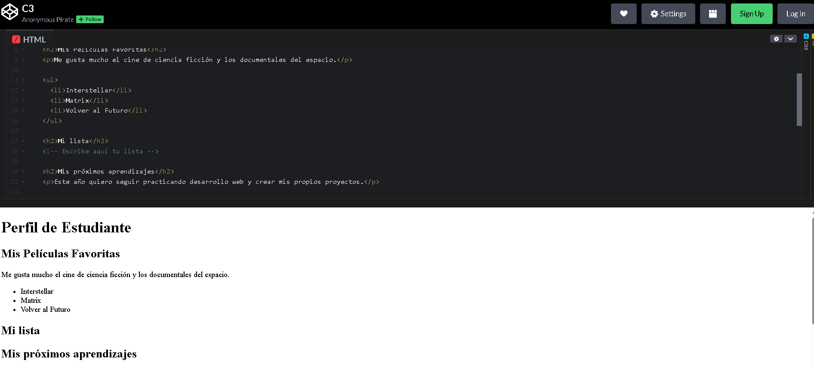

## Video de la Clase y Entorno de Práctica

*Enlace al video de YouTube:* [**https://youtu.be/w65R31rmauc**](https://youtu.be/w65R31rmauc)

Para esta clase continuaremos usando **CodePen**, el mismo entorno en línea que usamos la clase pasada. No necesitas instalar nada en tu computadora. Haz clic en el siguiente enlace para abrir el código inicial de la clase ya precargado: [**https://codepen.io/ST-A-the-encoder/pen/qEqQevO**](https://codepen.io/ST-A-the-encoder/pen/qEqQevO)

Al igual que en la clase anterior, verás la interfaz con los panales divididos.

{width=80%}

## Notas de la Clase

¡Hola! Imagina leer un libro que no tiene títulos, capítulos ni separación entre párrafos. Sería muy difícil de entender, ¿verdad? Lo mismo pasa en las páginas web. Hoy aprenderemos a organizar nuestra información para que todos puedan leerla fácilmente.

**¿Cómo leemos una página?**

Antes de escribir código, pensemos en cómo leemos una página. Si todo aparece en un solo bloque gigante, el visitante se cansa rápido y no sabe por dónde empezar. En cambio, cuando usamos títulos, párrafos y listas, la información se vuelve más fácil de explorar. Organizar no significa decorar; significa darle estructura al contenido para que cualquier persona entienda qué es lo principal, qué es una explicación y qué elementos pertenecen a una lista.

**Los Encabezados (Jerarquía)**

Para crear títulos, usamos las etiquetas `<h1>` hasta `<h6>`. El `<h1>` es el título principal, el más grande, y solo debe haber uno por página. Los `<h2>` y `<h3>` son como subtítulos. Los encabezados funcionan como una jerarquía. El `<h1>` representa el título principal de toda la página, por ejemplo: 
```html
<h1>Perfil de Estudiante</h1>
```
Después usamos `<h2>` para secciones grandes, como:
```html
<h2>Mis Películas Favoritas</h2>
```
O
```html
<h2>Mis próximos aprendizajes</h2>
```
Si dentro de una sección queremos agregar una parte más específica, podemos usar `<h3>`. Lo importante es no elegir el encabezado solo porque se ve más grande o más pequeño, sino por la importancia del contenido.

**Los Párrafos**

El párrafo `<p>` sirve para desarrollar una idea. Por ejemplo, si el encabezado dice "Mis Películas Favoritas", el párrafo puede explicar por qué te gusta ese tema: "Me gusta mucho el cine de ciencia ficción y los documentales del espacio". El título presenta la idea, pero el párrafo la explica. Por eso no conviene colocar toda la información dentro de un encabezado. Los encabezados guían; los párrafos cuentan.

**Las Listas (Ordenadas y Desordenadas)**

¿Y si queremos hacer una lista? ¡Tenemos dos opciones! Si el orden no importa, como una lista de compras, usamos `<ul>` (Unordered List) y colocamos viñetas. Si el orden es clave, como los pasos de un tutorial, usamos `<ol>` (Ordered List) que nos dará números. Vamos a crear una lista `<ul>` con nuestras películas favoritas.

Una lista funciona como una caja. Primero abrimos la lista con `<ul>` o `<ol>`. Luego, cada elemento individual se escribe con `<li>`. Finalmente, cerramos la lista completa. Por ejemplo, dentro de `<ul>` colocamos `<li>Interstellar</li>`, `<li>Matrix</li>` y `<li>Volver al Futuro</li>`. No escribimos los elementos sueltos directamente, porque cada opción debe estar dentro de su propia etiqueta `<li>`.

Ahora veamos con más atención la lista ordenada `<ol>`. Esta etiqueta se usa cuando los elementos tienen una secuencia o un orden recomendado. En nuestro ejemplo, la ruta de aprendizaje empieza con `<li>HTML avanzado</li>`, luego continúa con `<li>Programar con CSS</li>` y finalmente llega a `<li>Crear una aplicación web completa</li>`. Aquí los números ayudan porque muestran un camino paso a paso. Si cambiamos el orden, la idea puede perder sentido. Por eso, cuando quieras mostrar instrucciones, rankings, procesos o rutas de aprendizaje, una lista `<ol>` suele ser la mejor opción.

## Actividad Práctica de la Clase: 

**El Reto de la Lista:**

Ahora es tu turno. Escribe tres elementos dentro de tu lista. Pueden ser tres películas, tres videojuegos, tres canciones o tres metas. Recuerda: la lista es la caja grande, sea `<ul>` u `<ol>`, y cada elemento individual va dentro de una etiqueta `<li>`. Cuando termines, revisa si cada elemento tiene apertura y cierre.

## Recomendaciones y Errores Comunes para Principiantes

Un error común es escribir elementos `<li>` fuera de una lista. Recuerda que los `<li>` deben estar dentro de `<ul>` o `<ol>`. Otro error es usar un encabezado para escribir un texto largo. Si es una explicación, usa `<p>`. Y también revisa que tus listas estén cerradas correctamente. Puedes leer el código como cajas: abro la lista, agrego elementos, cierro cada elemento y al final cierro la lista.

## Recursos Complementarios de la Clase

- **Código HTML inicial de la lección:** [starter-files/lesson-03/index.html](https://github.com/upc-pre-1asi0730-2610-10215-arcadiadevs/webdev-course-arcadiadevs/blob/main/starter-files/lesson-03/index.html)
- **Código HTML final de la lección:** [completed-examples/lesson-03/index.html](https://github.com/upc-pre-1asi0730-2610-10215-arcadiadevs/webdev-course-arcadiadevs/blob/main/completed-examples/lesson-03/index.html)