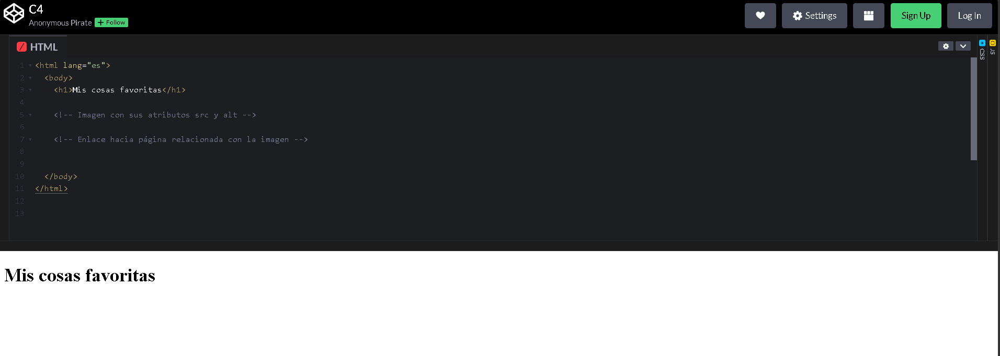

# Multimedia y navegación

## Video de la Clase y Entorno de Práctica

*Enlace al video de YouTube:* [**falta**](falta)

Para esta clase continuaremos usando **CodePen**, el mismo entorno en línea que usamos la clase pasada. No necesitas instalar nada en tu computadora. Haz clic en el siguiente enlace para abrir el código inicial de la clase ya precargado: [**https://codepen.io/ST-A-the-encoder/pen/NPbejLJ**](https://codepen.io/ST-A-the-encoder/pen/NPbejLJ)

Al igual que en la clase anterior, verás la interfaz con los panales divididos.

{width=80%}

## Notas de la Clase

¡Hola! Hasta ahora nuestra página tiene mucha información valiosa, pero admitámoslo, ¡el texto solo puede ser un poco aburrido! Es hora de añadir colores, caras y destinos. Es hora de aprender a insertar imágenes y enlaces.

**Elegir imágenes con propósito**

Antes de insertar cualquier imagen, pensemos en su propósito. Una imagen debe ayudar a entender mejor el contenido. Por ejemplo, si hablamos de mascotas, una foto de un perro o un gato tiene sentido. Si hablamos del espacio, una imagen de planetas o estrellas puede reforzar la idea. Pero si colocamos una imagen que no tiene relación, el visitante puede confundirse. En una buena página web, las imágenes no son solo decoración: también comunican. Por eso, antes de copiar cualquier imagen, pregúntate: ¿esta imagen ayuda a explicar mi página?, ¿se relaciona con el tema?, ¿hace que el contenido sea más claro?

**Insertando la primera imagen**

Para agregar una foto usamos la etiqueta ``. Pero aquí viene el truco: esta etiqueta no necesita cerrarse como las demás, ¡trabaja sola! Lo que sí necesita es un atributo esencial llamado src (que significa fuente). Ahí colocamos la dirección web de nuestra imagen.

El atributo src puede recibir una dirección de internet o una ruta de archivo. Si usamos una dirección completa, veremos algo como "https://...", porque la imagen viene desde una página externa. También podríamos usar una ruta local, como `imagenes/gato.jpg`, cuando la imagen está guardada dentro de nuestro propio proyecto. En CodePen es más fácil empezar con una URL de internet, porque no tenemos que subir archivos. Lo importante es que el valor de src esté entre comillas y apunte exactamente al lugar donde está la imagen. Si una letra falta, si el enlace está incompleto o si la imagen ya no existe, el navegador no podrá mostrarla.

**El atributo de accesibilidad (alt)**

Un requisito muy importante para ser buenos desarrolladores es pensar en todos. Si la imagen no carga por alguna razón, o si una persona con discapacidad visual visita nuestra página, usamos el atributo alt (texto alternativo) para describir qué hay en la foto. El atributo alt no debería decir solo imagen o foto, porque eso no explica nada. Un buen texto alternativo describe lo importante de la imagen. Por ejemplo, `alt="Un gato curioso mirando hacia la cámara"` es más útil que `alt="gato"`. No tiene que ser larguísimo, pero sí claro. Piensa que alguien podría entender tu página sin ver la imagen, solo leyendo esa descripción. Además, si la imagen no carga, ese texto puede ayudar al visitante a saber qué debía aparecer ahí. Por eso, el alt no es un adorno: es parte del contenido accesible de la página.

**Viajando por internet (Enlaces)**

¿Cómo conectamos nuestra página con el resto del mundo? ¡Con enlaces! Utilizamos la etiqueta `<a>` (de "ancla" en inglés). A esta etiqueta le damos el atributo href, donde declaramos hacia dónde queremos viajar al hacer clic.

Un enlace tiene varias partes. Primero está la etiqueta <a>, que crea el enlace. Luego aparece el atributo href, donde colocamos el destino. Después está la dirección, por ejemplo "https://www.nasa.gov/". Y finalmente tenemos el texto visible, que es lo que el visitante lee y puede presionar. Entonces, el href es el destino real, mientras que el texto entre `<a>` y `</a>` es la invitación que mostramos en pantalla.

Un enlace debe estar relacionado con el contenido que lo rodea. Si escribes un párrafo sobre el espacio, tiene sentido enlazar una página sobre astronomía ("https://astronomiaparatodos.com/") o una agencia espacial ("https://www.nasa.gov/"). Si hablas de música, podrías enlazar una página sobre tu artista favorito o un recurso para aprender más ("https://testculturageneral.com/conocimientos-musicales-test/"). La idea es que el enlace amplíe la información, no que distraiga. Una buena página web no solo coloca enlaces por colocar; los usa para guiar al visitante hacia contenido útil.

## Actividad Práctica de la Clase: 

**El Reto de la Navegación:**

Ahora es tu turno. Primero, elige un tema que te guste: animales, videojuegos, música, deportes o espacio. Luego busca una imagen relacionada y copia su dirección. En tu código, crea una etiqueta `` con src y alt. Después, agrega un enlace con `<a>` hacia una página relacionada con ese tema. Por ejemplo, si elegiste el espacio, puedes enlazar una página de la NASA. Finalmente, cambia el texto visible del enlace para que sea claro, como Aprende más sobre el espacio. Al terminar, revisa que la imagen cargue y que el enlace te lleve al sitio correcto.

## Recomendaciones y Errores Comunes para Principiantes

Cuando escribas enlaces, evita usar siempre frases como "clic aquí". Es mejor que el texto explique el destino. Por ejemplo, "visita la página de la NASA" es más claro que solo "clic aquí", porque el visitante sabe a dónde irá antes de presionar. También intenta que el enlace esté relacionado con el contenido cercano. Si estás hablando de un lugar, una herramienta o un tema específico, el enlace debe ayudar a ampliar esa información.

## Recursos Complementarios de la Clase

- **Código HTML inicial de la lección:** [starter-files/lesson-04/index.html](https://github.com/upc-pre-1asi0730-2610-10215-arcadiadevs/webdev-course-arcadiadevs/blob/main/starter-files/lesson-04/index.html)
- **Código HTML final de la lección:** [completed-examples/lesson-04/index.html](https://github.com/upc-pre-1asi0730-2610-10215-arcadiadevs/webdev-course-arcadiadevs/blob/main/completed-examples/lesson-04/index.html)