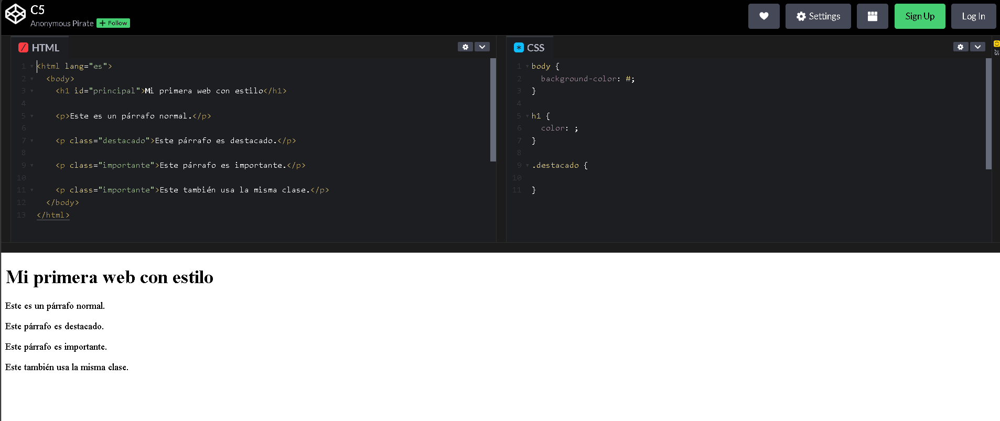

# Conoce a CSS

## Video de la Clase y Entorno de Práctica

*Enlace al video de YouTube:* [**https://youtu.be/p9jFo2NlXC4**](https://youtu.be/p9jFo2NlXC4)

Para esta clase continuaremos usando **CodePen**, el mismo entorno en línea que usamos la clase pasada. No necesitas instalar nada en tu computadora. Haz clic en el siguiente enlace para abrir el código inicial de la clase ya precargado: [**https://codepen.io/ST-A-the-encoder/pen/YPpLKBp**](https://codepen.io/ST-A-the-encoder/pen/YPpLKBp)

Al igual que en la clase anterior, verás la interfaz con los panales divididos.

{width=80%}

## Notas de la Clase

Hasta ahora, hemos construido un excelente esqueleto para nuestra aplicación usando HTML. Sin embargo, no tiene mucho estilo. ¡Es hora de pintar y decorar nuestra casa! Hoy vamos a conocer oficialmente a CSS (que significa *Hojas de Estilo en Cascada*, por sus siglas en inglés)

**La regla CSS (El Selector)**

A diferencia de HTML, en CSS no usamos etiquetas con < >. Usamos algo llamado 'reglas'. Para empezar, debemos decirle a CSS a quién queremos pintar. A esto se le llama **selector**. Como selector podemos usar el nombre de una etiqueta, como `h1` o `body`, ya que CSS busca todas las etiquetas con ese nombre y les aplica el estilo. Pero CSS tiene más formas de seleccionar elementos. Por ejemplo, si usamos `.destacado`, estamos llamando a una clase. Las clases sirven cuando queremos aplicar el mismo estilo a varios elementos diferentes. En HTML se vería como: 
```html
class="destacado"
```
También existe el selector con numeral, como `#principal`, que se usa para un identificador único escrito como: 
```html
id="principal"
```
Para empezar, quédate con esta idea: la etiqueta sirve para estilos generales, la clase sirve para reutilizar estilos, y el id sirve para un elemento muy específico

**Las Llaves (El espacio de trabajo)**

Una vez que llamamos a nuestro selector, abrimos unas llaves { }. Todo lo que escribamos dentro de estas llaves será la lista de instrucciones de diseño exclusivamente para ese elemento.

```css
body {

}
```

**Propiedades y Valores**

Ahora le damos nuestra instrucción. En CSS, las instrucciones se dividen en dos: la propiedad (qué queremos cambiar) y el valor (cómo queremos que se vea). Le diremos background-color (propiedad) luego dos puntos (:\), seguido de lightblue (el valor). ¡Y un requisito súper importante! Siempre, siempre terminamos la instrucción con un punto y coma (;\).

```css
body {
  background-color: lightblue;
}
```

**Estilizando el Texto**

Hagamos lo mismo con nuestro título. Llamamos al selector h1, abrimos las llaves, usamos la propiedad color y le damos un valor, como darkblue. Ahora nuestro título principal ahora tiene más vida.

```css
h1 {
  color: darkblue;
}
```

**Colores en Inglés y Códigos Hexadecimales**

Para los colores, CSS acepta nombres en inglés como `red`, `blue`, `pink` o `lightgreen`. También acepta códigos de color, como `#fce4ec` (códigos en base hexadecimal). Por ahora puedes usar nombres porque son más fáciles de recordar. Más adelante, los códigos te permitirán elegir tonos más exactos.

No todos los colores funcionan bien juntos. Si el fondo es muy claro y el texto también es claro, será difícil leer. Un buen diseño no solo se ve bonito: también se entiende. Antes de elegir colores, revisa si puedes leer el texto sin esfuerzo. Si tienes que acercarte demasiado a la pantalla, quizá necesitas más contraste.

## Actividad Práctica de la Clase: 

**El Reto del Contraste:**

Ahora es tu turno. Prueba dos combinaciones de colores. Primero cambia el fondo del `body`. Luego cambia el color del `h1`. Observa qué combinaciones se ven bien y cuáles no. Esta exploración es parte del aprendizaje: CSS se entiende mucho mejor probando.

## Recomendaciones y Errores Comunes para Principiantes

Cuando CSS no funciona, revisa la puntuación. ¿Pusiste dos puntos entre propiedad y valor? ¿Terminaste con punto y coma? ¿Cerraste las llaves? Estos símbolos parecen pequeños, pero CSS los necesita para entender tus instrucciones. Si una regla no se aplica, muchas veces el problema está en un detalle de escritura. Además, hay algo importante: existen varias formas de escribir CSS. En CodePen tenemos un panel CSS separado, que se parece a trabajar con un archivo propio de estilos. Esa suele ser la forma más ordenada, porque mantiene el HTML por un lado y el diseño por otro. También podríamos escribir CSS dentro de una etiqueta `<style>` en la parte `<head>` del HTML. Eso funciona para ejemplos pequeños, pero si la página crece puede volverse difícil de organizar.

También existe el atributo `style`, que se escribe directamente dentro de una etiqueta HTML. Esto cambia solo ese elemento específico. Es rápido para probar, pero no conviene usarlo demasiado, porque mezcla contenido con diseño y hace que el código sea más difícil de mantener. En este curso usaremos principalmente el panel de CSS, porque queremos practicar la separación entre estructura y apariencia.

## Recursos Complementarios de la Clase

- **Código HTML inicial de la lección:** [starter-files/lesson-05/index.html](https://github.com/upc-pre-1asi0730-2610-10215-arcadiadevs/webdev-course-arcadiadevs/blob/main/starter-files/lesson-05/index.html)
- **Código CSS inicial de la lección:** [starter-files/lesson-05/styles.css](https://github.com/upc-pre-1asi0730-2610-10215-arcadiadevs/webdev-course-arcadiadevs/blob/main/starter-files/lesson-05/styles.css)
- **Código HTML final de la lección:** [completed-examples/lesson-05/index.html](https://github.com/upc-pre-1asi0730-2610-10215-arcadiadevs/webdev-course-arcadiadevs/blob/main/completed-examples/lesson-05/index.html)
- **Código CSS final de la lección:** [completed-examples/lesson-05/styles.css](https://github.com/upc-pre-1asi0730-2610-10215-arcadiadevs/webdev-course-arcadiadevs/blob/main/completed-examples/lesson-05/styles.css)