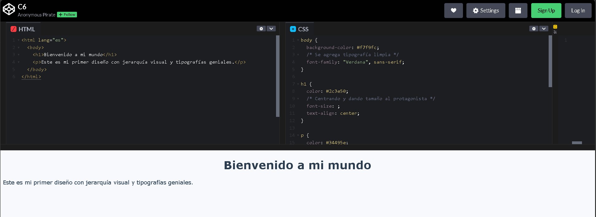

# Tipografía y Estilo

## Video de la Clase y Entorno de Práctica

*Enlace al video de YouTube:* [**https://youtu.be/ATvGFyKL7Zs**](https://youtu.be/ATvGFyKL7Zs)

Para esta clase continuaremos usando **CodePen**, el mismo entorno en línea que usamos la clase pasada. No necesitas instalar nada en tu computadora. Haz clic en el siguiente enlace para abrir el código inicial de la clase ya precargado: [**https://codepen.io/ST-A-the-encoder/pen/qEqQevO**](https://codepen.io/ST-A-the-encoder/pen/qEqQevO)

Al igual que en la clase anterior, verás la interfaz con los panales divididos.

{width=80%}

## Notas de la Clase

¡Hola de nuevo! Imagina que lees una solicitud formal escrita con letras de cómic; nadie te tomaría en serio. La letra, o 'tipografía', comunica emociones. Hoy le pondremos personalidad a nuestra página cambiando sus fuentes y tamaños.

**Cambiando la Fuente (font-family)**

Para cambiar el tipo de letra, usamos la propiedad `font-family`. Veamos cómo cambia nuestro texto principal si le damos un estilo limpio y sin adornos conocido como *sans-serif*, por ejemplo, 'Verdana' o 'Helvetica'. Escribiremos: 

```css
font-family: Verdana, sans-serif;.
```

Cuando escribimos `font-family: Verdana, sans-serif;`, estamos dando una primera opción y una opción de respaldo. Le decimos al navegador: usa Verdana si está disponible; si no, usa cualquier fuente sin adornos, es decir, una `sans-serif`. Esto ayuda a que la página se siga viendo bien aunque no todos los dispositivos tengan exactamente las mismas fuentes.

Las fuentes serif tienen pequeños detalles o remates en las puntas de las letras. Las fuentes sans-serif no tienen esos remates y suelen verse más limpias en pantalla. Para principiantes, las fuentes sans-serif como Arial, Verdana o Helvetica son una buena elección porque se leen fácilmente.

**Traer fuentes de internet**

Hay una biblioteca enorme y gratuita llamada [Google Fonts](https://fonts.google.com/). Si encuentras una fuente genial, como 'Roboto' o 'Pacifico', puedes importarla a tu proyecto. Para mantenerlo simple, usaremos fuentes que ya vienen en todos los navegadores, pero ten en mente que internet está lleno de opciones de fuentes para obtener e instalar.

**Tamaños y Jerarquía visual**

Un requisito para un buen diseño es guiar los ojos del visitante. A esto le decimos *jerarquía visual*. Lo más importante debe ser lo más grande. Vamos a usar la propiedad font-size para darle a nuestro título h1 un tamaño de 40px (píxeles), y a nuestro párrafo un tamaño base de 18px, para que se lea fácil. 

**Alineación y lectura**

A veces queremos que los títulos estén centrados. Con tan solo agregar `text-align: center;` en la regla de nuestro h1.

Centrar un título puede hacerlo más llamativo. Pero no siempre conviene centrar textos largos, porque leer muchas líneas centradas puede cansar. En este ejercicio centramoss el título para practicar `text-align`, pero cuando tengas párrafos largos, prueba dejarlos alineados a la izquierda para que sean más cómodos.

## Actividad Práctica de la Clase: 

**El Reto de los Tamaños:**

Ahora es tu turno. Cambia el tamaño del párrafo. Prueba `18px`, luego `20px` y después `24px`. Pregúntate: ¿cuál se lee mejor?, ¿cuál se ve exagerado?, ¿cuál queda equilibrado con el título? No hay una única respuesta perfecta, pero sí hay decisiones más cómodas para el usuario.

## Recomendaciones y Errores Comunes para Principiantes

En CSS, muchas propiedades usan guiones. Por ejemplo, se escribe `font-family`, no `font family`; y se escribe `font-size`, no `font size`. Si una propiedad está mal escrita, el navegador simplemente la ignora. Por eso, cuando algo no cambie, revisa primero el nombre exacto de la propiedad.

## Recursos Complementarios de la Clase

- **Código HTML inicial de la lección:** [starter-files/lesson-06/index.html](https://github.com/upc-pre-1asi0730-2610-10215-arcadiadevs/webdev-course-arcadiadevs/blob/main/starter-files/lesson-06/index.html)
- **Código CSS inicial de la lección:** [starter-files/lesson-06/styles.css](https://github.com/upc-pre-1asi0730-2610-10215-arcadiadevs/webdev-course-arcadiadevs/blob/main/starter-files/lesson-06/styles.css)
- **Código HTML final de la lección:** [completed-examples/lesson-06/index.html](https://github.com/upc-pre-1asi0730-2610-10215-arcadiadevs/webdev-course-arcadiadevs/blob/main/completed-examples/lesson-06/index.html)
- **Código CSS final de la lección:** [completed-examples/lesson-06/styles.css](https://github.com/upc-pre-1asi0730-2610-10215-arcadiadevs/webdev-course-arcadiadevs/blob/main/completed-examples/lesson-06/styles.css)