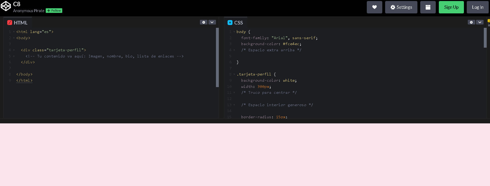

# Proyecto Final y Próximos Pasos

## Video de la Clase y Entorno de Práctica

*Enlace al video de YouTube:* [**https://youtu.be/nHa5fpodhXo**](https://youtu.be/nHa5fpodhXo)

Para esta clase continuaremos usando **CodePen**, el mismo entorno en línea que usamos la clase pasada. No necesitas instalar nada en tu computadora. Haz clic en el siguiente enlace para abrir el código inicial de la clase ya precargado: [**https://codepen.io/ST-A-the-encoder/pen/PwbdYRo**](https://codepen.io/ST-A-the-encoder/pen/PwbdYRo)

Al igual que en la clase anterior, verás la interfaz con los panales divididos.

{width=80%}

## Notas de la Clase

¡Felicidades! Has llegado a la última lección. Has aprendido el esqueleto (HTML) y la pintura (CSS), cómo organizar información y dar espacio al diseño. Ahora, tomaremos todo eso para cumplir nuestro requisito final: crear tu primera aplicación web completa, un Perfil Personal en línea.

**Presentación del producto final**

Antes de empezar, veamos qué construiremos. Nuestra página tendrá una tarjeta de perfil personal. En la parte superior colocaremos una imagen o avatar. Luego agregaremos un título con el nombre, un párrafo breve de presentación y una sección de enlaces. La idea no es que todos hagan exactamente la misma página, sino que cada uno pueda personalizarla con su nombre, sus gustos, sus colores y sus propios enlaces.

"Para tu proyecto final, crearás una tarjeta centrada usando nuestro truco `margin: auto`. Le pondrás tu nombre con un `<h1>`, una foto tuya o de tu avatar con la etiqueta ``, una breve biografía en un párrafo `<p>` y, al final, una lista desordenada `<ul>` con enlaces `<a>` a tus redes o hobbies favoritos.

**La caja principal del perfil en HTML**

Primero necesitamos una caja principal para guardar todo el perfil. Para eso usamos un div con la clase tarjeta-perfil. El div no muestra algo especial por sí solo, pero nos permite agrupar varios elementos. Dentro de esta caja colocaremos la imagen, el nombre, la descripción y los enlaces. La clase `tarjeta-perfil` será importante porque después, desde CSS, podremos darle forma a toda esta caja.

Ahora agregamos la imagen del perfil usando la etiqueta ``. Esta etiqueta necesita el atributo `src`, donde colocamos la dirección de la imagen. También usamos `alt`, que sirve para describir la imagen si no carga o si una persona usa un lector de pantalla. En este ejemplo usamos una imagen de avatar, pero tú podrías usar una foto propia o una imagen libre.

Después de la imagen colocamos el nombre con un `<h1>`, porque será el título principal de nuestra tarjeta. Debajo escribimos una breve presentación dentro de un párrafo `<p>`. Aquí puedes contar algo sencillo sobre ti: tus gustos, tus intereses o lo que estás aprendiendo. Con esto, la tarjeta ya empieza a tener identidad.

Ahora agregamos una sección para los enlaces. Primero usamos un `<h2>` con el texto "Mis Enlaces". Luego creamos una lista desordenada con `<ul>`. Dentro de la lista, cada elemento va con `<li>`. Y dentro de cada elemento colocamos un enlace usando `<a>`. El atributo `href` indica a qué página irá el visitante cuando haga clic. Por ejemplo, podemos enlazar GitHub, un blog o una página que nos guste.

**Conectando HTML y CSS con la clase tarjeta-perfil**

Observa esta conexión: en HTML escribimos `class="tarjeta-perfil"`, y en CSS usamos `.tarjeta-perfil`. Eso significa que todos los estilos dentro de esa regla se aplicarán a nuestra caja principal. Esta relación entre HTML y CSS es clave: HTML crea los elementos y CSS decide cómo se ven.

```css
.tarjeta-perfil {

}
```

**Dando forma visual a la tarjeta con CSS**

Ahora sí vamos a darle diseño a la tarjeta. Con `background-color: white;` hacemos que destaque sobre el fondo. Con `width: 300px;` controlamos su ancho. Con `margin: auto;` la centramos. Luego `padding: 30px;` agrega espacio interior para que el contenido no toque los bordes. `border-radius: 15px;` redondea las esquinas, `text-align: center;` centra el contenido, y `box-shadow` agrega una sombra suave para que parezca una tarjeta real.

También podemos mejorar partes específicas. En la imagen usamos `width` y `height` de `150px` para darle un tamaño fijo. Con `object-fit: cover;` evitamos que se deforme, y con `border-radius: 50%;` la convertimos en un círculo. Luego limpiamos la lista con `list-style: none;` y `padding: 0;`, para quitar las viñetas y el espacio extra. En cada `li` agregamos margen para separar los enlaces, y con:

```css
a { 
  color: #c2185b; 
}
``` 
Cambiamos el color de los enlaces.

## Recomendaciones y Errores Comunes para Principiantes

Antes de terminar, revisa esta lista. Primero, confirma que el div principal tenga la clase tarjeta-perfil. Segundo, revisa que esa misma clase exista en CSS como `.tarjeta-perfil`. Tercero, verifica que la imagen tenga src y alt. Cuarto, asegúrate de que los enlaces tengan href. Quinto, revisa que etiquetas como `<div>`, `<ul>`, `<li>` y `<a>` estén bien cerradas. Y sexto, en CSS confirma que no falten puntos y comas o llaves de cierre.

## Personalización responsable y próximos pasos

Ahora puedes personalizar tu perfil. Cambia el nombre, la descripción, los enlaces, los colores y la imagen. Solo recuerda mantener la legibilidad: el texto debe poder leerse sin esfuerzo. También evita usar imágenes sin permiso en proyectos públicos; puedes usar un avatar propio o una imagen libre. Este proyecto final resume todo lo aprendido: estructura HTML, imágenes, enlaces, colores, tipografía, espacios y bordes. A partir de aquí puedes seguir practicando con diseño adaptable para celulares, formularios y más adelante JavaScript para crear páginas interactivas.

## Recursos Complementarios de la Clase

- **Código HTML inicial de la lección:** [starter-files/lesson-08/index.html](https://github.com/upc-pre-1asi0730-2610-10215-arcadiadevs/webdev-course-arcadiadevs/blob/main/starter-files/lesson-08/index.html)
- **Código CSS inicial de la lección:** [starter-files/lesson-08/styles.css](https://github.com/upc-pre-1asi0730-2610-10215-arcadiadevs/webdev-course-arcadiadevs/blob/main/starter-files/lesson-08/styles.css)
- **Código HTML final de la lección:** [completed-examples/lesson-08/index.html](https://github.com/upc-pre-1asi0730-2610-10215-arcadiadevs/webdev-course-arcadiadevs/blob/main/completed-examples/lesson-08/index.html)
- **Código CSS final de la lección:** [completed-examples/lesson-08/styles.css](https://github.com/upc-pre-1asi0730-2610-10215-arcadiadevs/webdev-course-arcadiadevs/blob/main/completed-examples/lesson-08/styles.css)