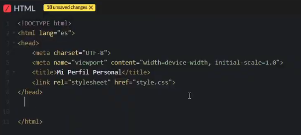
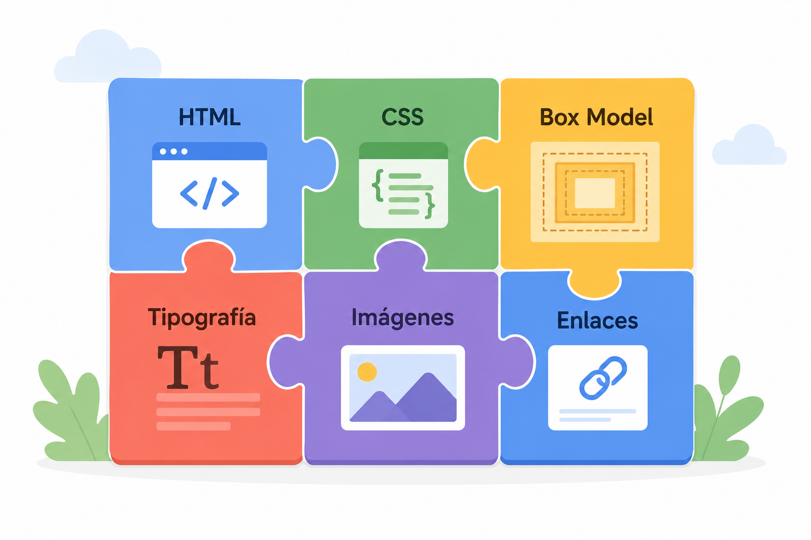
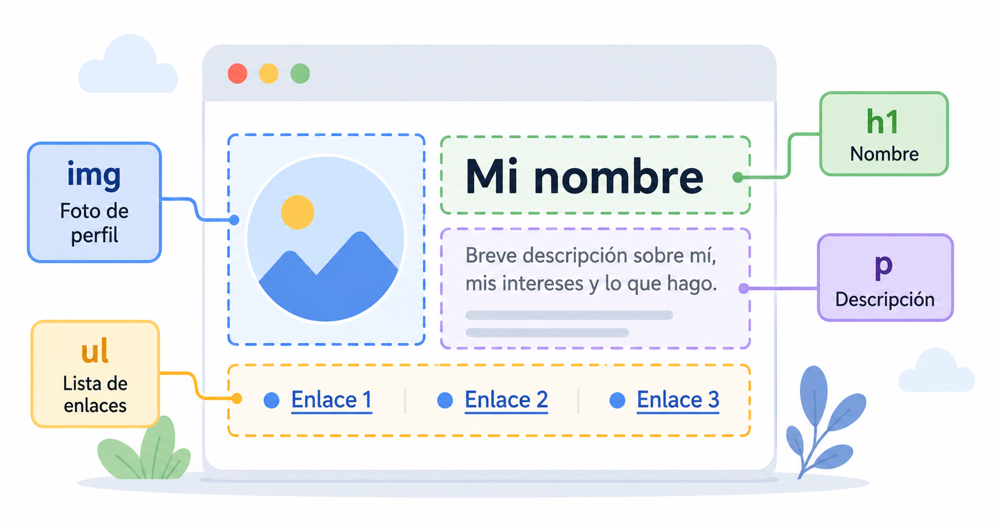
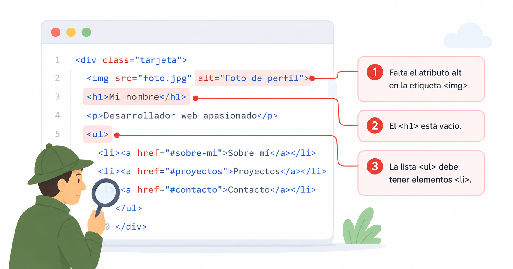
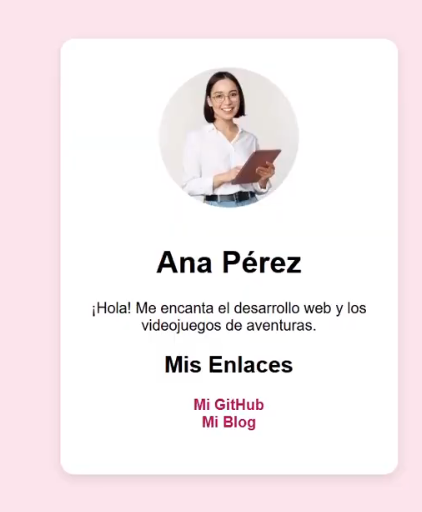

# Lección 8: Proyecto Final y Próximos Pasos

## Video de la Clase
*Enlace al video de YouTube:* [Añadir enlace aquí]

## Entorno de Práctica
Empieza a programar de inmediato (¡Sin instalar nada!):

- **[Abrir CodePen - Plantilla inicial precargada: https://codepen.io/pen](https://codepen.io/pen)**



## Transcripción / Notas de la Clase
¡Felicidades, creadores! Has llegado a la última lección. Ya aprendiste el esqueleto de la web (HTML), su pintura (CSS), cómo organizar información con listas y tablas, y cómo dar espacio al diseño con el Box Model. Hoy tomamos todo eso y lo unimos para construir tu primera aplicación web completa: una **Página de Perfil Personal**.



**Mudándonos a Replit:**
Hasta ahora trabajamos en CodePen, donde HTML y CSS convivían en paneles del mismo editor. Para este proyecto final, daremos un paso profesional y usaremos Replit, una herramienta que nos permite tener nuestros archivos separados, tal como lo hacen los desarrolladores en el mundo real. Tendrás un archivo `index.html` para tu estructura y un `style.css` para todo tu diseño. Conectarlos es sencillo: solo una línea en el `<head>` de tu HTML lo hace todo:
```html
<link rel="stylesheet" href="style.css">
```

**Uniendo todas las Piezas:**
Para tu perfil, vamos a construir una tarjeta centrada en la pantalla. Piensa en ella como la tarjeta de presentación digital que le mostrarías al mundo. Dentro de un `<div class="tarjeta-perfil">` irán cuatro ingredientes que ya conoces: tu foto con ``, tu nombre con `<h1>`, una breve bio en un `<p>` y una lista de enlaces `<ul>` a tus redes o proyectos favoritos.



Para centrar la tarjeta en el CSS usamos nuestro truco favorito, `margin: auto;`, junto con un `width` fijo. Combinado con `padding` para el espacio interior y `border-radius` para los bordes redondeados, la tarjeta se ve limpia y profesional de inmediato.

**Código de Inicio (Starter):**

*Abre esta plantilla en Replit y úsala como punto de partida:*

**HTML (index.html):**
```html
<html lang="es">
<head>
  <title>Mi Perfil Personal</title>
  <!-- Esto enlaza tu HTML con tu CSS -->
  <link rel="stylesheet" href="style.css">
</head>
<body>

  <div class="tarjeta-perfil">
    <!-- Tu contenido va aquí: Imagen, nombre, bio, lista de enlaces -->

  </div>

</body>
</html>
```

**CSS (style.css):**
```css
body {
  font-family: "Arial", sans-serif;
  background-color: #fce4ec;
}

.tarjeta-perfil {
  background-color: white;
  width: 300px;
  /* ¡Usa el truco mágico para centrar! */

  /* Añade padding para dar espacio interior */

  /* Extra: vamos a darle bordes redondeados */
  border-radius: 15px;
}

/* Modifica el texto e imágenes como gustes */
```

**Checklist: ¿Por qué no funciona mi código?**
Antes de pedir ayuda, revisa siempre estas tres cosas. El 90% de los errores de un principiante están aquí:

1. ¿Cerraste todas tus etiquetas HTML con la barra inclinada? Ejemplo: `</div>`, `</ul>`.
2. ¿Olvidaste los dos puntos `:` o el punto y coma `;` en tu CSS?
3. ¿Está bien escrita la ruta de tu imagen en el atributo `src`?



**Cierre y Próximos Pasos:**
Una vez terminado, Replit te da una URL pública para que compartas tu perfil con quien quieras. El desarrollo web es un camino de práctica constante: sigue experimentando con colores, tipografías y nuevas etiquetas. Hay muchas más tecnologías y librerías por descubrir. ¡Mucho éxito en tus futuros proyectos, desarrollador!

## Actividad Práctica:

**Reto Final (15-20 minutos): ¡Construye tu Perfil!**

1. Abre tu plantilla en Replit y ve al archivo `index.html`.
2. Dentro de `<div class="tarjeta-perfil">` agrega: una foto tuya o un avatar (``), tu nombre (`<h1>`), un párrafo sobre ti (`<p>`) y una lista de dos o más enlaces a tus redes o hobbies (`<ul>` con `<a>`).
3. Ve a `style.css` y usa `margin: auto;` para centrar la tarjeta. Añade `padding: 20px;` para que el contenido respire.
4. Juega con `background-color`, prueba diferentes valores de `border-radius` y personaliza los colores a tu gusto.
5. Corre tu código, revisa el checklist si algo falla y ¡obsérvalo brillar! Tienes tu propia página web en línea.

## Recursos Complementarios del Proyecto



**Código Final (Solution):**

**HTML (index.html):**
```html
<html lang="es">
<head>
  <title>Perfil de Estudiante</title>
  <link rel="stylesheet" href="style.css">
</head>
<body>

  <div class="tarjeta-perfil">
    
    <h1>Ana Pérez</h1>
    <p>¡Hola! Me encanta el desarrollo web y los videojuegos de aventuras.</p>

    <h2>Mis Enlaces</h2>
    <ul>
      <li><a href="https://github.com">Mi GitHub</a></li>
      <li><a href="https://ejemplo.com">Mi Blog</a></li>
    </ul>
  </div>

</body>
</html>
```

**CSS (style.css):**
```css
body {
  font-family: "Arial", sans-serif;
  background-color: #fce4ec;
  padding-top: 40px;
}

.tarjeta-perfil {
  background-color: white;
  width: 300px;
  margin: auto;
  padding: 30px;
  border-radius: 15px;
  text-align: center;
}

img {
  width: 150px;
  border-radius: 50%;
}

a {
  color: #c2185b;
}
```

- **Plantilla inicial de la lección:** [lesson-8/starter/index.html](../../lesson-8/starter/index.html)
- **Código elaborado en clase:** [lesson-8/completed/index.html](../../lesson-8/completed/index.html)

---
